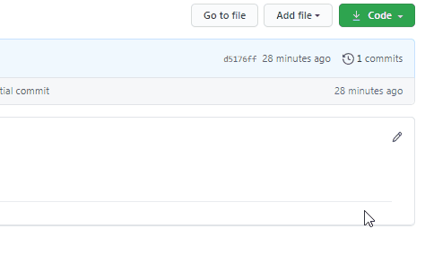

### Obtenha um Repositório (Clone)

Neste capítulo, vamos aprender a baixar um repositório para a nossa máquina. Essa funcionalidade é chamada de **clone**, então vamos clonar um repositório.

#### Clonando o repositório via Interface

Para fazer o clone via a interface do github, vá ao repositório que você qquer clonar, ao lado direito na telavai ter um botão **Code**, clique e ele vai abrir uma dropdown com algumas opções.

1 Clone with SSH: Ele libera para copiar um link para usar no seu terminal, esse tipo de clone precisa de uma configuração á mais na sua máquina com protocolo SSH `https://github.com/tatielirb/meu-primeire-repo.git`. 
- Para mais informações na [documentação oficial](https://docs.github.com/pt/github/authenticating-to-github/adding-a-new-ssh-key-to-your-github-account)

2 Clone with HTTPS: Ele libera para copiar um link para usar no seu terminal, com protocolo de HTTPs `https://github.com/tatielirb/meu-primeire-repo.git`. É mais simples.

3 Open with GitHub Desktop: Essa opção é feita atraves [GitHub Desktop](https://desktop.github.com/)

4 Download ZIP: Essa opção baixa uma pasta .zip com todos os arquivos do repositório.




#### Clonando o repositório via linha de código

Para clonar via linha de código vamos usar o comando `git clone <link copiado>`.

Vá até o repositório que você deseja clonar no github, no botão  **Code** selecione a opção de clonar via **Clone with HTTPS**, copie o link e vá até seu terminal e cole ele.

**Linha de código**
```
$ git clone https://github.com/tatielirb/meu-primeire-repo.git
```


**Resultado**
```
$ git clone https://github.com/tatielirb/meu-primeire-repo.git
Cloning into 'meu-primeire-repo'...
remote: Enumerating objects: 3, done.
remote: Counting objects: 100% (3/3), done.
remote: Total 3 (delta 0), reused 0 (delta 0), pack-reused 0
Unpacking objects: 100% (3/3), 590 bytes | 3.00 KiB/s, done.
```
Temos o repositorio clonado na sua maquina.