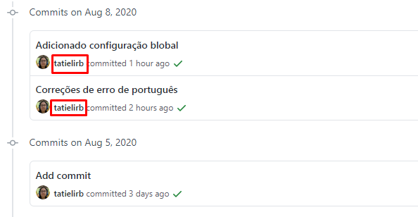

### Config Global

Nosse primeire passo é nós indentificar para o Git, para que todas as modificações tenham a assinatura do nosse ususer.
Execute os dois seguintes comandos com seu nome e e-mail respectivamente:

```
$ git config --global user.name "Seu nome"
$ git config --global user.email "seu-email@example.com"
```

Essa indentificação de assinatura vai ser mostrado no GitHub na lista de commits (Históricos) ou em outros pontos, como Pull Request (que vamos ver mais para frente):



