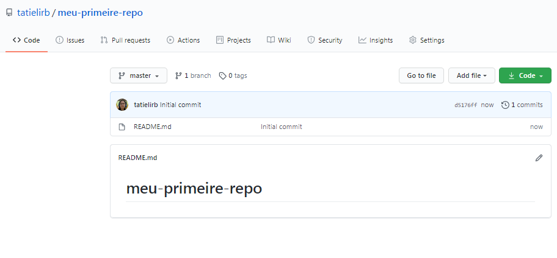

## Novo Repositório (init)

Nessa capítulo vamos aprender a criar um repositório para o nosso projeto.

### Criando nossa pasta
Vamos criar uma nova pasta em um local do seu computador chamada *meu-primeire-repo*.

Use os comandos `mkdir` no seu terminal

**Solução**

```
$ mkdir meu-primeire-repo
$ ls
meu-primeire-repo/ 
```


### Vamos fazer um init por linha de código

Vamos entrar na nossa pasta, você pode fazer isso por linha de comando `cd meu-primeire-repo` ou por área gráfica.


Agora, em dentro da nossa pasta, que vai estar vazia vamos indicar que utilizaremos Git nesse projeto com o comando `git init`. Esse comando irá criar uma pasta oculta chamada **.git** na pasta onde ficarão armazenados todos os arquivos referentes à história do projeto. 

```
$ git init
Initialized empty Git repository in C:/Users/userdasuamaquina/Documents/meu-primeire-re
po/.git/

```

Para que nosso repositório apareça no GitHub, vamo precisar subir a nossa pasta. Isso vamos aprender nos próximos capítulos.


### Criando um repositório na interface

Além da linha de comando podemos criar um repositório na interface do GitHub

Quando você entrar no site do [GitHub](https://github.com/) , ao lado esquerdo vamo ter um botão **New**, clique nele:


Ele vai redirecionar você para a tela de criação do repositório.


1 Vamos preencher **Repository name** , caso o nome não esteja dentro do padrão aceitável ele vai informar com uma mensagem em vermelho.

2 O nosso repositório pode ser public ou Private.
- Public: São usados para repositórios em geral que podem receber contribuição, repositórios públicos qualquer pessoa tem acesso a ver o seu código e mandar um pull request para contribuir, é muito bom para projetos de estudos e projetos abertos a comunidades. 

- Private: São projetos usados mais por empresas, mas podemos também criar repositórios privados e adicionar até 3 pessoas para colaborar nele. Projetos privados somente pessoas que têm acesso podem contribuir e ver os códigos. 

3 Initialize this repository with a README, essa opção você pode marcar, com isso o seu projeto vai ter um documento inicial chamado **README** , ele serve para que possamos colocar informações do nosso projeto e de como fazer ele funcionar no computador de outras pessoas.

4 Clique no **Create repository** e pronto temos o nosso repositório. 

Após clicar no **Create repository** ele automaticamente vai redirecionar para a tela do nosso novo repositório.
