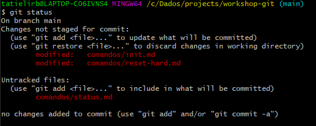
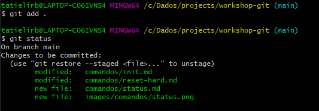

## Mudanças (status)
 
As vezes é necessário visualizar as nossas alterações realizadas antes de subir. Inclusive os arquivos que estamos prestes a mandar para nosso repositório no servidor.
 
Para isso podemos usar o comando:
 
```
$ git status
```
 
**Resultado**
 

 
se você executar o comando `git add .` os arquivos e novamente executar o `git status` o resultado será diferente.
 

