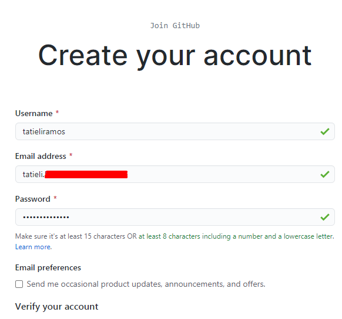
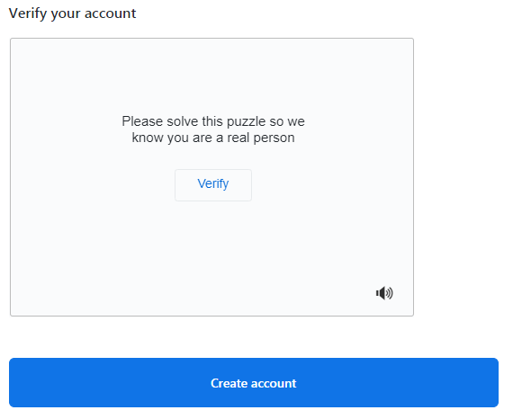
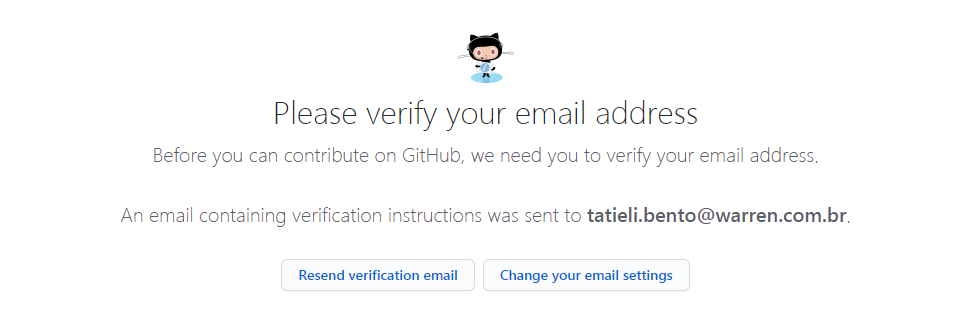

## Criando conta no GitHub

1 Vamos acessar o site do [GitHub](https://github.com/)

2 Clique em **SIGN UP** : 

3 Preencha os campos com:
* Username: Lembrese que esse user vai ser seu mais movo amiges, por isso escolha com sabedoria. Uma dica é
usar o seu nome e as iniciais do seu sobrenome.
* Email address: Utilizei sempre um e-mail valido e que você tenha acesso, pois você vai precisar confirmar sua conta.
* Password: use sempre uma senha forte, o proprio site não permite senhas muito faceis.

4 Faça a verificação e  **Create accout** :

5 O site vai realizar uma mini pesquisa, o qual você pode responder conforme lhe inclua melhor:

6 Não esqueça de verificar o seu e-mail, se lembra que falei de usar um e-mail valido :D :

7 Apos a confirmação vai aparecer essa tela, você pode fazer uma das opções ou simplesmente Pular:

Prontinho temos a nossa conta \o/

Curiosidade: Você sabia que o mascote do GitHub é polvo-gato e seu nome è Octocat, e que você pode criar uma versão personalizada?

[GitHub my octocat](https://myoctocat.com/build-your-octocat/)
