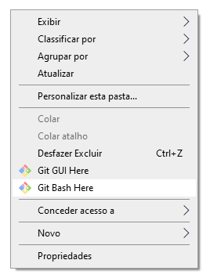

## Instalando o Git!

A instalação vai depender do sistema operacional de sua máquina:

[Git para OSX](https://git-scm.com/download/mac) 

[Git para Windows](https://gitforwindows.org/) 

[Git para Linuxs](https://git-scm.com/book/pt-br/v2/Come%C3%A7ando-Instalando-o-Git) 

Como temos sistemas Operacioais diferentes, cada sistema vai ter sua forma de fazer a instação do Git! Nesse tutorial vamos focar no sistema operacional para Windows.

### Instalação no Windows

Após fazer download do instalador, execute :

E vamos do nosso famose Next:


Ao final da instalação vamos ter configurado o git e o terminal na sua máquina. Para abri o terminal você pode clicar com o botão direito do seu mouse e vai ter `Git Bash Here`:



Esse será nosso terminal:


Após realizar a instalação você pode executar o comando `git --version` no seu terminal para identificar se tudo ocorreu bem.

**Esse será nosse resultado**
```
C:\Users\userdoseupc> git --version
git version 2.28.0.windows.1
```
