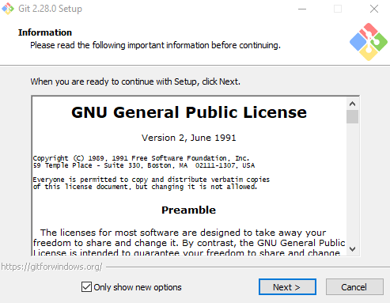
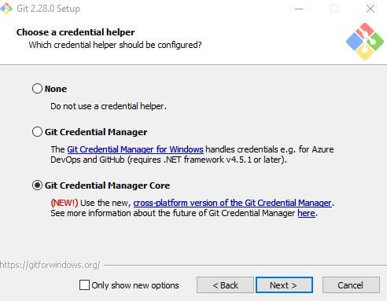
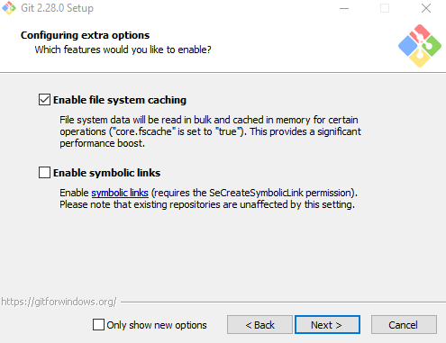
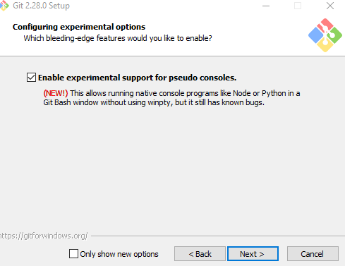
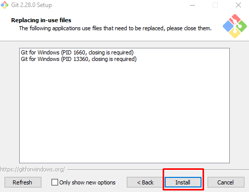
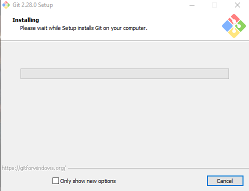
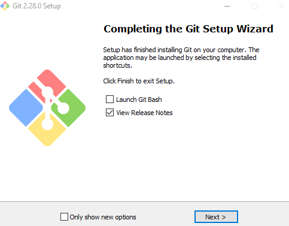
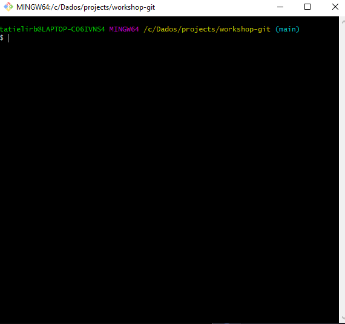

## Instalando o Git!

A instalação vai depender do sistema operacional de sua maquina:

[Git para OSX](https://git-scm.com/download/mac) 

[Git para Windows](https://gitforwindows.org/) 

[Git para Linuxs](https://git-scm.com/book/pt-br/v2/Come%C3%A7ando-Instalando-o-Git) 

### Instalação no Windows

Apos fazer dawload do instalador, execute :

E vamos do nosso famose Next

Ao final da instalação vamos ter configurado o git e o terminal na sua maquina.

